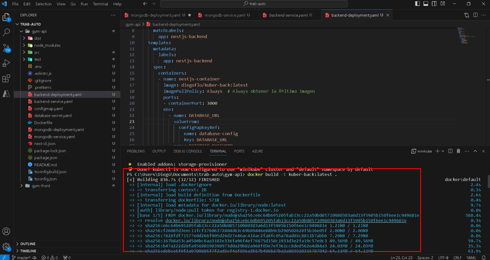
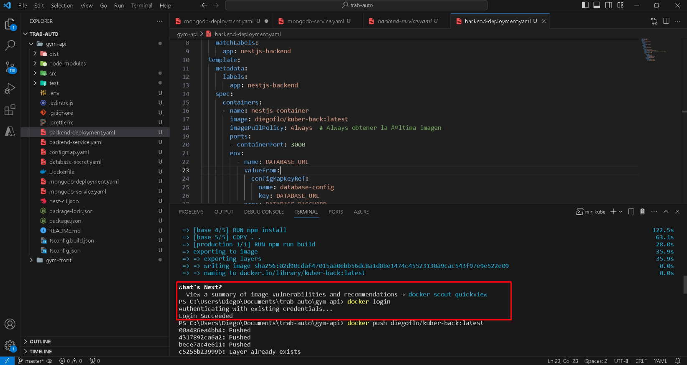
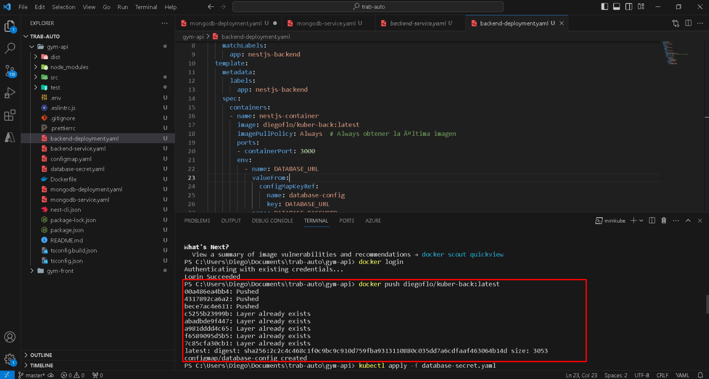
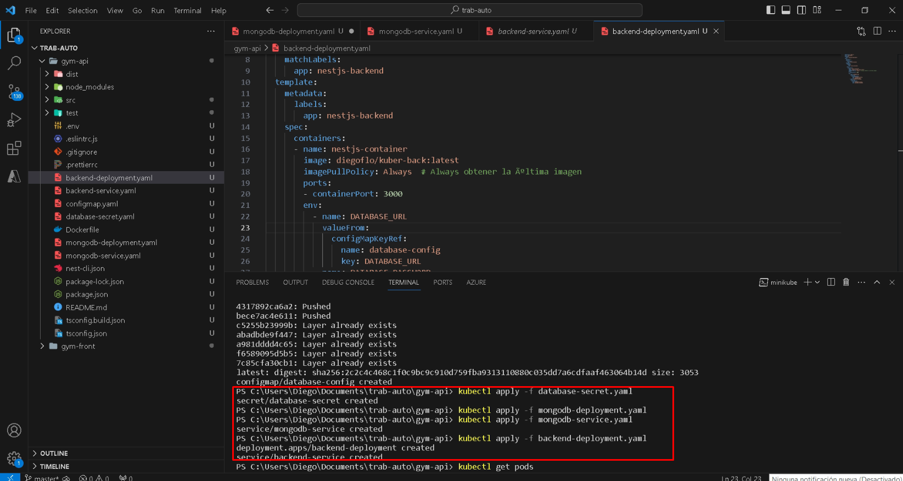
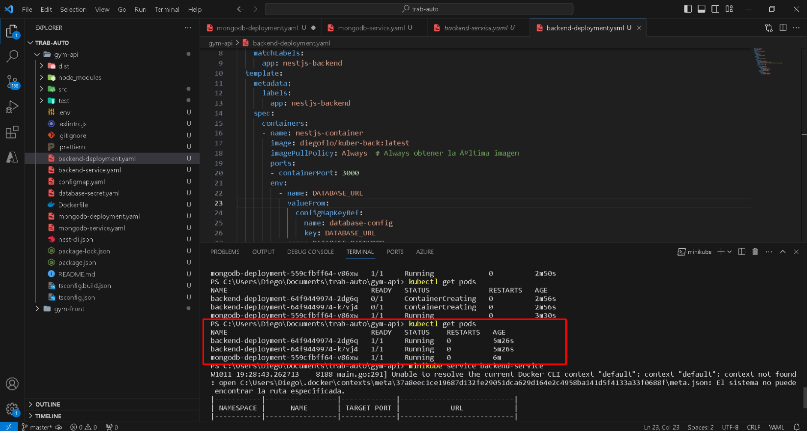
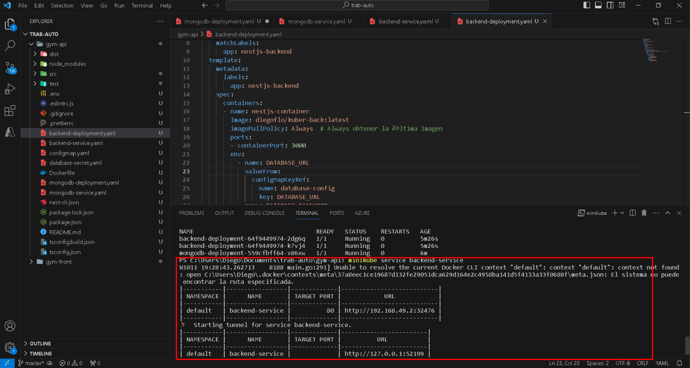
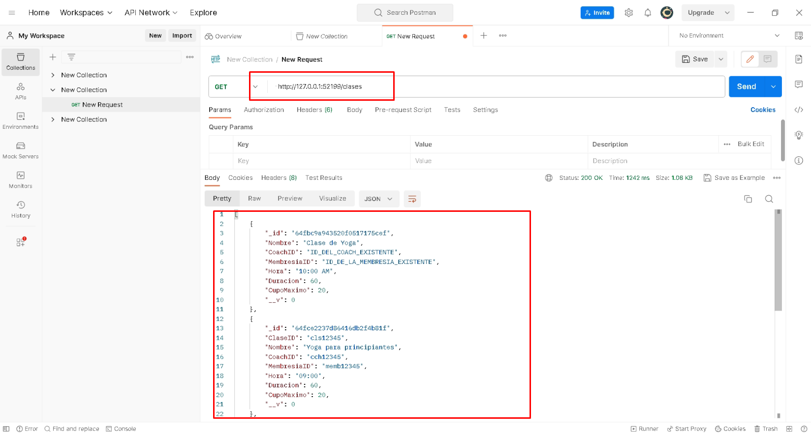
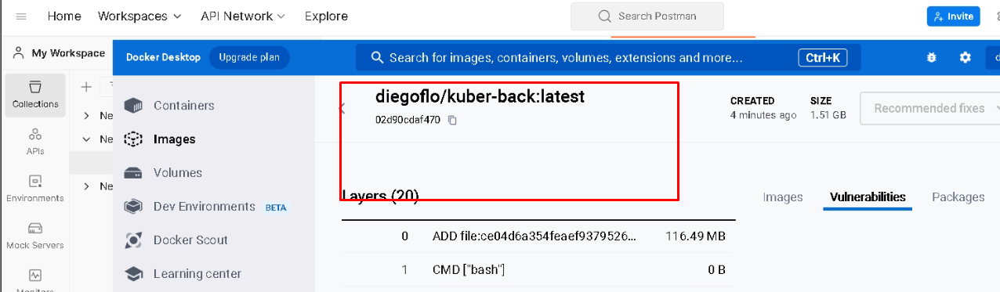

| Antony Palacios | Gustavo Rodriguez | Cristhopher Alcivar | Diego Flores | Ian Velez | Isaac Joviric |
| ------ | ------ | ------ | ------ |  ------ | ------ |
|<p align="center"><a href="https://github.com/byotony"></a></p>|<p align="center"><a href="https://github.com/gusrsl"></a></p>|<p align="center"><a href="https://github.com/krixsjdk"></a></p>|<p align="center"><a href="https://github.com/diegoflores16"></a></p>|<p align="center"><a href="https://github.com/e1313326363"></a></p>|<p align="center"><a href="https://github.com/IsaacJ95"></a></p>|

## Testing

### 1er Paso.
#### Nos movemos de ubicacion y generamos la imagen.


### 2do Paso.
#### Nos logeamos con docker para continuar con los pasos


### 3er Paso.
#### Le hacemos docker push para subirlo a la nube


### 4to Paso
#### Luego comenzamos a aplicar los cambios en todos nuestros archivos .yaml


### 5to Paso (OPCIONAL)
#### Corremos el siguiente codigo para verificar que lo que creamos esta corriendo
```sh
  kubectl get pods
```


### 6to Paso
#### Corremos con el siguiente código verificando que todo funcione de manera correcta, y aquí una vez ejecutado nos dará la dirección en la que se alojó.
```sh
    minikube service backend-service  
```    


### 8vo Paso
#### Con la direccion que nos proporcionó podemos hacer post y gest con la herramienta Postaman para evaluar si funcionamiento.



### 10mo Paso
#### Aquí podemos ver la image creada de docker.

